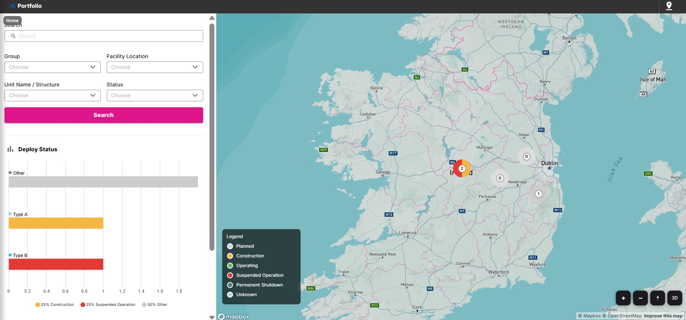
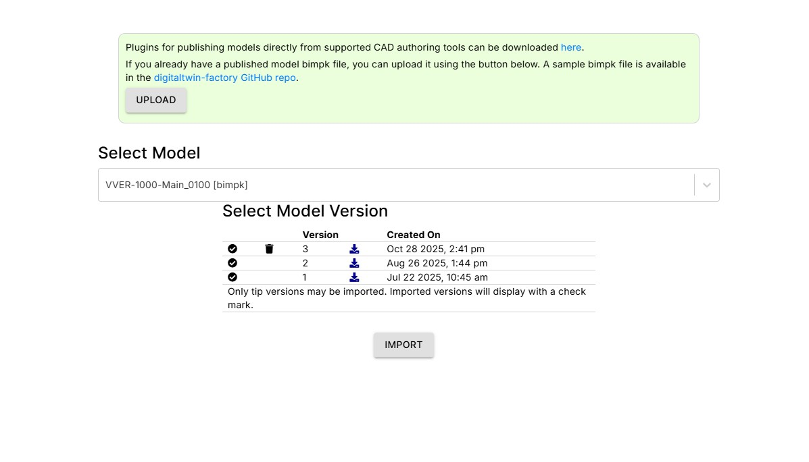
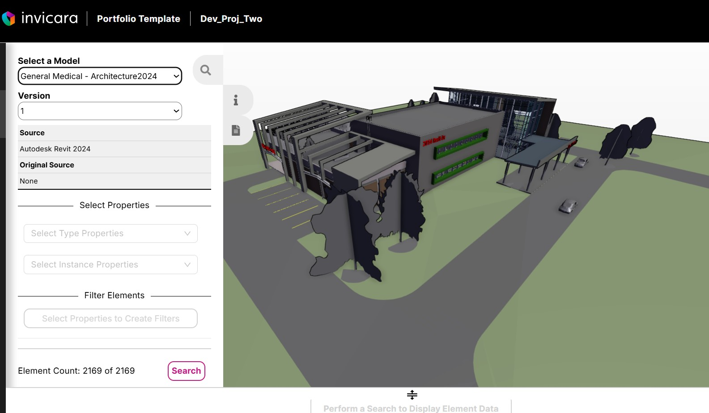
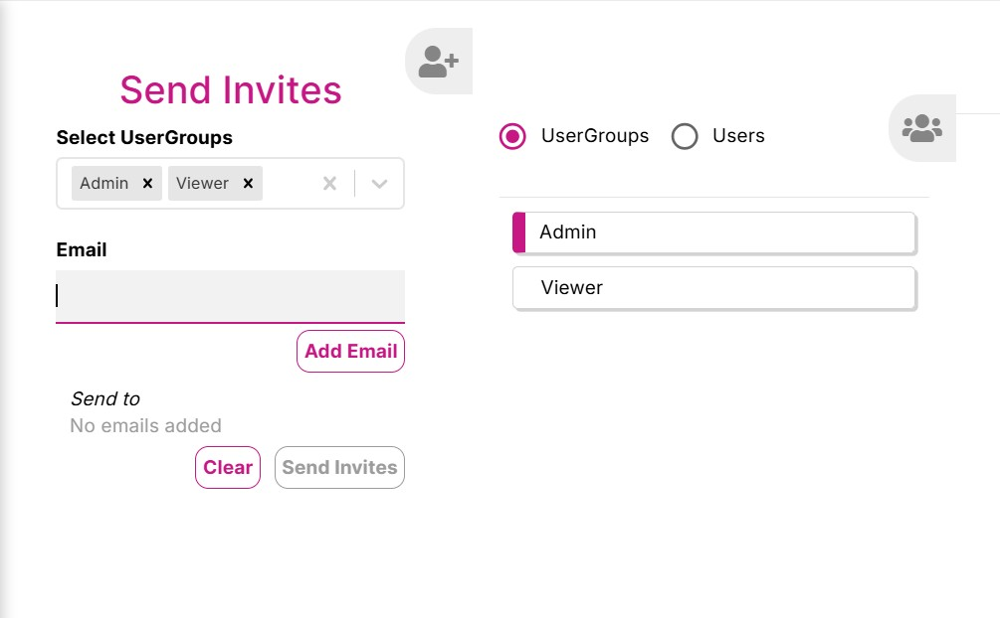

# Template Portfolio – Twinit Application Template

Release: 1.0.2

> **Project name**: This application is called **Template Portfolio**. The repository may be named differently (e.g. Hitachi-Fleet-Management-PoC) in your environment.

**Template Portfolio** is a project template that lets you view all your structures and their digital twins on a single map. Each site is shown within its perimeter, so you can see at a glance where your assets are and how they relate. The interface surfaces structure and asset information through **map markers** and **chart data** (e.g. status, KPIs, or custom metrics), so key information is visible directly on the map and in the UI.

*Marker information on the map for building or asset data within a site.*

*Customizable legend data on the map regarding building information to display.*

*The bar chart displays assets collectively categorized by their data types. The chart is selectable by data type and can filter the marker and data information on the map for easy search and find or data drilling.*

*The Assets Overview displays model element and properties information in an organized tree view and table display by the map building and site data.*

**Search and filtering** make it easy to find specific structures, sites, or building types for analysis. The **Asset Overview** (portfolio detail) view lets you explore elements and properties of your assets in an **ordered tree view and table layout**. The **template package** can be customized so you can change the layout, map types, and how your data is displayed to match your project—whether you are managing building portfolios, energy performance, or other asset-focused workflows.

> **Note**: Template Portfolio requires a valid Twinit account and the ability to run or deploy a React web client. Completion of the Self-Led Developer training (including React UI) on [Twinit Academy](https://academy.twinit.io/) is recommended before implementing the template.

## Example use case

As a **Building Portfolio Manager**, I open a map view (e.g. GIS) and see all the buildings I manage in one place. I can benchmark performance (e.g. energy, environmental, or service KPIs) between buildings so I can spot outliers and opportunities. From the portfolio view I identify a building that stands out (e.g. higher energy usage). I select that building on the map to open its **Digital Twin** and drill into subsystems (e.g. HVAC, lighting). By comparing that building’s data with others in my portfolio, I can pinpoint issues (e.g. HVAC running longer or at higher capacity), plan onsite inspections, and create improvement or ROI plans using the twin and analytics. Template Portfolio supports this kind of portfolio-level visibility, drill-down into individual assets, and data-driven decision making.

## Features

| | |
| --------------- | -------------------|
|  | Import multiple CAD models (including BIMPK) into projects |
| View models and element properties; download reports to Excel |  |
|  | Mapbox integration to view models on a map with sites and structures |
|  | Invite users and collaborate on Portfolio projects |

## What’s included

* Scripts and user config templates for the Portfolio application UI (map view, Asset Overview, search and filters).
* A React web client to build and deploy for your users.
* A **template package** (`setup/template packages/portfolioPkg`) that you can zip and deploy via the Twinit extension to create new projects with a default setup (map types, structures, optional default site, optional models/BIMPKs). You can tweak this package to change how data and layouts are displayed for your project.

## Documentation

Two sets of documentation are provided:

* A **[Developer Guide](./docs/developer%20guide/README.md)** – How to deploy the Template Portfolio application to Twinit, set up a default project using the template package zip (**portfolio-template.zip**; New Project → Deploy Template to Project), customize the template package (map types, structures, models, BIMPKs), and build and deploy the web client.
* A **[User Guide](./docs/user%20guide/README.md)** – How to use the Template Portfolio application (portfolio map, models, comparison, filters).

## Getting started

* **If you are a developer** looking to deploy the template for your users or to customize the default project setup, start with the [Developer Guide](./docs/developer%20guide/README.md) and then [Setting up a default project](./docs/developer%20guide/setup-default-project.md) and [Customizing the template package](./docs/developer%20guide/customize-template-package.md).
* **If you are a user** looking for guidance on using the application that a developer has deployed for you, start with the [User Guide](./docs/user%20guide/README.md) to learn how to use the portfolio map and view models.

## Release notes

See [Release Notes](./docs/release-notes.md) for version history and changes (if present).
