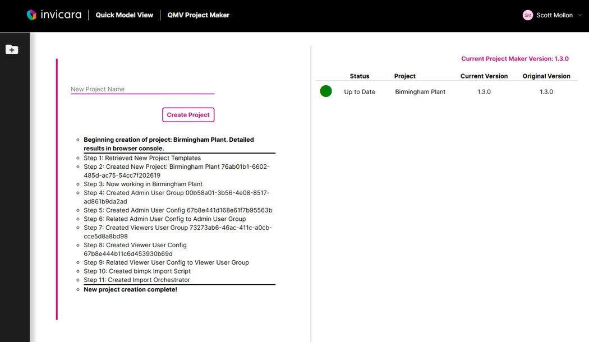

# Learn How to Use the Quick Model View Project Maker

## Features

* **Create new Quick Model View projects**. Using the Quick Model View Project Maker you can quickly and easily create new Quick Model View projects.
* **Update existing projects to the latest version**. COMING SOON.

## User Groups

Project Maker projects have one User Group:

* Admin

Users in the **Admin** user group have full permissions to all resources in the Quick Model View project.

## Tutorials

* [How to create a new project](./createproject.md)
* [How to add new Project Maker Users](./addmakers.md)
