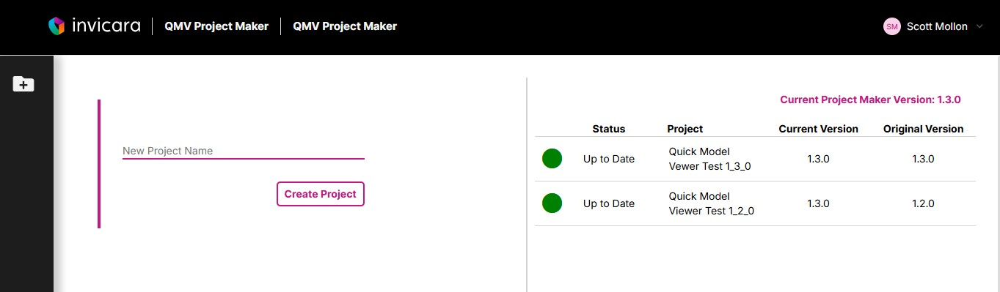

# Learn How to Use the Portfolio Manager

## Features

* **Create new Template Portfolio projects**. Using the Portfolio Manager (Twinit extension), you can create new projects under your Template Portfolio application.
* **Deploy the template package to a project**. After creating a project, you deploy the template package (zip from the repo’s `setup` folder) so the project gets map types, structures, optional default site, and optional models/BIMPKs. See the [Developer Guide: Setting up a default project](../../developer%20guide/setup-default-project.md) for step-by-step instructions.
* **Update existing projects**. When new template versions are available, you can redeploy or update your projects to take advantage of new features or data.

## How to create a project and deploy the template

1. In the **Twinit VS Code extension**, right-click your **application name** (e.g. Template Portfolio) and select **New Project**. Enter project name, description, and short name.
2. Right-click the **new project name** and select **Deploy Template to Project**.
3. When prompted, select the **template package zip** from the `setup` folder of this repository (e.g. `portfolio-template.zip` or a zip of `setup/template packages/portfolioPkg`).

The project will be configured with the default map types, structures, and any default site or models defined in the template package. Developers can customize what gets deployed by editing the files in `setup/template packages/portfolioPkg`; see the [Developer Guide: Customizing the template package](../../developer%20guide/customize-template-package.md).

---

[User Guide](../README.md) < Back
