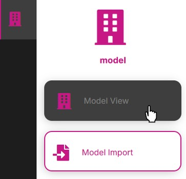
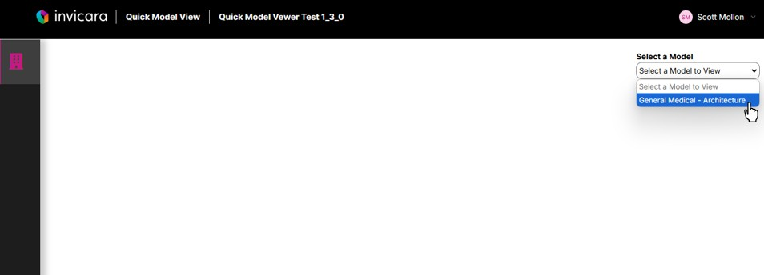
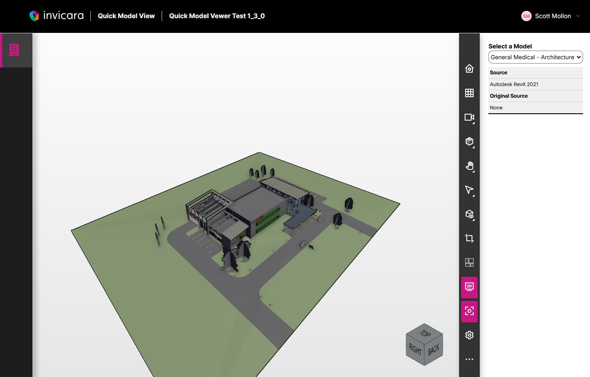
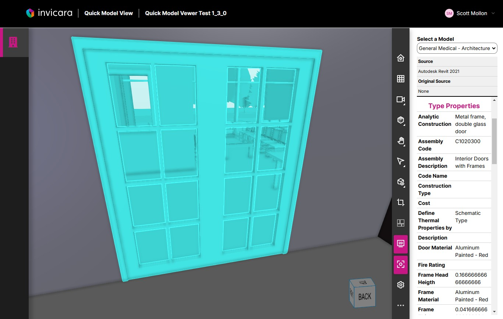

# How to View a Model and Model Element Properties

1. Select the Model View page

2. Select a model n the Select a Model dropdown

3. The selected model will load in the viewer

4. Click on an element in the model and the element properties will display in the panel on the right

---
[Quick Model View User Guide](./README.md) < Back